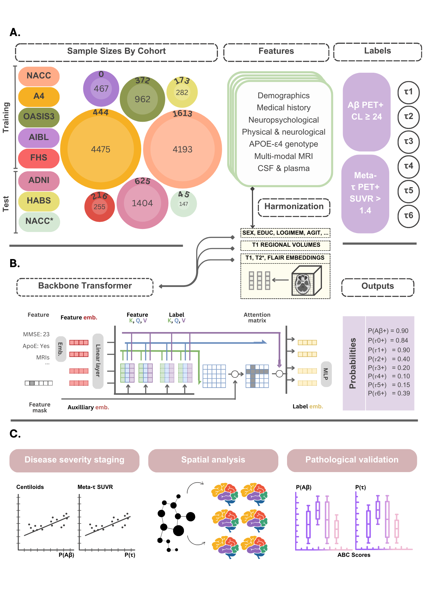

# AI-driven fusion of neurological work-up for assessment of biological Alzheimer's disease

# Introduction
This repository implements a transformer-based model for predicting amyloid-β (Aβ) and tau (𝜏) PET positivity in Alzheimer’s disease using multimodal clinical data. Leveraging data from $12,185$ participants across seven diverse cohorts, our model integrates demographics, medical history, functional assessments, neuropsychological test scores, neuroimaging, and fluid biomarkers. The model classifies individuals as amyloid PET positive or negative globally, and tau PET positive or negative within a widely used meta-temporal region. Additionally, it identifies abnormal 𝜏 accumulation in six key brain regions: medial temporal, lateral temporal, medial parietal, lateral parietal, frontal, and occipital. On a held-out test set, model-predicted probabilities aligned with true PET positivity, and an aggregate "AT score" derived from these probabilities tracked established disease stages.



**Figure 1: Data, model development and validation strategy.** (a) Our model for assessing amyloid and tau status was developed using diverse data modalities, including individual-level demographics, health history, genetic information, neuropsychological testing, physical/neurological exams, and multi-sequence MRI scans. These data sources were aggregated from seven independent cohorts: NACC, A4, OASIS3, AIBL, FHS, ADNI and HABS. All features were harmonized to the UDS3 format and embeddings were extracted from multi-modal MRI scans. Inner concentric circles provide the sample size of the cases with Aβ PET data and outer circles denote the sample size with 𝜏 PET data. (b) Each feature was transformed into a set length vector through a modality-specific embedding approach before being input into the main transformer. A linear layer then linked the transformer to the output prediction layer. (c) The external ADNI and HABS datasets, as well as a held-out set of NACC* data, were selected to compare pathology-specific model predicted probabilities with biological outcomes and neuropathology grades. Shapley analysis was run on the regional 𝜏 model, and a graphical network analysis was performed to detect clusters of important brain regions using the Shapley values of the T1-weighted derived volumes. A similar community detection algorithm was run on the raw regional tau PET SUVrs and we compared communities derived from Shapley values with those derived from the regional SUVrs with statistical testing. The model architecture schematic in (b) was reproduced from our previous work.

<!-- # Project structure -->

# Prerequisites

The tool was developed using the following dependencies:

1. Python (3.11.7)
1. PyTorch (2.4).
2. torchvision (0.19).
3. MONAI (1.3.2).
4. NumPy (1.26.3).
5. tqdm (4.66.5).
6. pandas (2.2.2).
7. nibabel (5.2.1).
9. matplotlib (3.9.1).
10. shap (0.46).
11. scikit-learn (1.5.1).
12. scipy (1.14).

Please refer to `requirements.txt` for the complete list of dependencies.

# Installation
Follow these steps to install the package
```
conda create --name new_env --file requirements.txt
conda activate new_env
pip install .
```

<!-- # Training
- Create a configuration file similar to ```dev/data/toml_files/stage_1.toml```, categorizing each feature as ```numerical```, ```categorical``` or ```imaging```. Please add the image embedding paths to your data file as another column and set the type of this feature as ```imaging``` in the configuration file. 
- Navigate to the repository's root directory 
- Add the correct training and validation data paths to ```dev/train.sh```. Demo data is provided for reference at ```pseudodata/```.
- If training using MRI embeddings, set these flags in ```dev/train.sh``` (please add the image embedding paths to the data file before setting these flags) :
    ```bash
    img_net="SwinUNETREMB" 
    img_mode=1 # loads MRI embeddings
    ```
- If training without MRI embeddings, set these flags in ```dev/train.sh``` :
    ```bash
    img_net="NonImg" 
    img_mode=-1
    ```
- Run ```bash dev/train.sh``` 

# Evaluation
## Generating model predictions

- The model predictions were generated using the script ```dev/generate_predictions.py```
- The deidentified source data for generating the plots are provided here ```figures/source_data/```
- To generate the figures:
    ```
    cd figures/plot_results
    python main.py
    ``` -->


# Training

1. **Prepare Configuration File**  
   Create a configuration file similar to [`dev/data/toml_files/stage_1.toml`].  
   - Categorize each feature as `numerical`, `categorical`, or `imaging`.  
   - If using image embeddings, add their paths as a new column in your dataset and mark the feature type as `imaging` in the config file.

2. **Set Up Training Script**  
   - Navigate to the root directory of the repository.  
   - Update the training and validation paths in `dev/train.sh`.  
   - Sample demo data is available in the `pseudodata/` directory.

3. **Specify Training Mode**  
   - **With MRI embeddings**:  
     Before running, make sure the data file includes the image embedding paths. Then set the following in `dev/train.sh`:
     ```bash
     img_net="SwinUNETREMB"
     img_mode=1  # loads MRI embeddings
     ```

   - **Without MRI embeddings**:  
     Set the following in `dev/train.sh`:
     ```bash
     img_net="NonImg"
     img_mode=-1
     ```

4. **Start Training**  
   Run the training script:
   ```bash
   bash dev/train.sh
   ```

# Evaluation

## Generate Model Predictions

- Run the following script by setting correct model checkpoint to generate model predictions:
  ```bash
  python dev/generate_predictions.py
  ```

- The de-identified source data used to generate the plots is available at:
  ```
  figures/source_data/
  ```
  Note that this data can be used to generate the figures without running `generate_predictions.py`.

## Generate Figures

To create the figures from prediction outputs:

```bash
cd figures/plot_results
python main.py
```